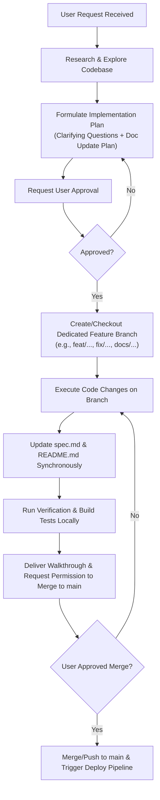

# Constitutional Rules & Operational Guidelines for Agents

This document defines the strict constitutional rules and operational mandates governing all AI coding agents working within the `bible-station` repository. Every agent must adhere to these principles without exception.

---

## 1. Constitutional Principles

### Rule 1: Implementation Plan First
- **Mandate**: No source code, configuration, or architectural modifications may be executed without first proposing a comprehensive **Implementation Plan**.
- **Contents**: The implementation plan must clearly specify:
  - Background and user goals
  - Any required design decisions or open clarifying questions
  - Proposed file changes grouped by component with `[NEW]`, `[MODIFY]`, or `[DELETE]` tags
  - Explicit plan for updating documentation files (`spec.md`, `README.md`)
  - Automated and manual verification strategy
- **Approval Requirement**: The agent must obtain explicit user review and approval before proceeding with code changes.

### Rule 2: Synchronous Documentation in `spec.md`
- **Mandate**: Every functional, architectural, component, routing, or data schema change must be documented in [spec.md](file:///Users/jared/Dev/bible-station/spec.md).
- **Rule of Completeness**: If a feature or behavior exists in the codebase, it must be accurately detailed in `spec.md`. If a feature is deprecated or modified, `spec.md` must be updated concurrently.

### Rule 3: Continuous `README.md` Maintenance
- **Mandate**: [README.md](file:///Users/jared/Dev/bible-station/README.md) must always be kept up to date following any repository modifications.
- **Scope**: Includes keeping project overview, setup guides, scripts, route descriptions, architecture links, and deployment guidelines current.

### Rule 4: Visual Fidelity & Aesthetic Standards
- **Mandate**: The user interface must preserve the refined typography, curated color palette, and layout aesthetic established in the reference design and guidelines.
- **Design Tokens**:
  - Background: `--bg-color: #fcfcfc`
  - Text Primary: `--text-main: #333333`
  - Text Muted: `--text-light: #666666`
  - Accent Color: `--accent-color: #4a6c6f` (Primary Slate Teal)
  - Secondary Accent: `--secondary-color: #5c7a6b` (Positive Muted Green)
  - Callout/Disclaimer: `--disclaimer-bg: #eef2f3`
- **Typography**: Georgia serif for scripture passages and game text; system sans-serif for UI, navigation, and controls.
- **Forbidden Clichés**: Avoid unprompted dark theme purple glow, gradient text fills, icon-stuffed bento boxes, or jarring decorative gimmicks.

### Rule 5: GitHub Pages CI/CD Integrity
- **Mandate**: All code merged or committed to the `main` branch must build cleanly and deploy successfully through the GitHub Pages workflow (`.github/workflows/deploy.yml`).
- **Pathing**: Ensure all asset references and Vue Router links function properly across local development (`/`) and GitHub Pages deployment base (`/bible-station/`). Clean HTML5 direct routing (no hash in URLs) is supported via the single-page application fallback mechanism.

### Rule 6: Verification & Non-Regression
- **Mandate**: Every change must be validated against automated builds and manual user verification criteria before declaring completion.
- **Regressions**: Existing functionalities (Scripture Memorizer 5 modes, Verses for Feelings 30 categories, Devotionals reading, responsive layout) must never be broken or degraded.

### Rule 7: Feature Branch Isolation & Protected `main` Branch
- **Mandate**: **NEVER make changes directly to `main` without explicit user permission.** All development, bug fixes, features, refactors, and document updates must occur in dedicated feature/task branches.
- **Branch Naming Standard**:
  - `feat/<feature-name>` for new features
  - `fix/<bug-name>` for bug fixes
  - `docs/<doc-topic>` for documentation improvements
  - `chore/<task-name>` for tooling and dependency updates
- **Merge/Deploy Protocol**: Merging into `main` or deploying to production requires explicit user review and permission after presenting a completed walkthrough and verification report.

---

## 2. Agent Workflow Protocol

---

## 3. Mandatory Checklist for Every Change

Before completing any task, every agent must confirm:
- [ ] Implementation plan was presented, reviewed, and approved.
- [ ] Work was executed on a dedicated feature/task branch (never directly on `main` without permission).
- [ ] Source code changes follow clean Vue 3 Composition/SFC patterns.
- [ ] [spec.md](file:///Users/jared/Dev/bible-station/spec.md) has been updated with any new or modified specifications.
- [ ] [README.md](file:///Users/jared/Dev/bible-station/README.md) reflects the latest changes and instructions.
- [ ] Build succeeds locally without errors or broken links.
- [ ] GitHub Actions pipeline configuration remains healthy and compatible.
- [ ] Explicit user permission was obtained prior to merging/pushing to `main`.
