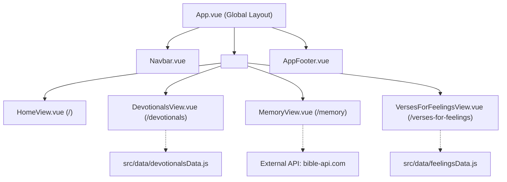

# Bible Station Application Specification (`spec.md`)

This document serves as the single source of truth for the architecture, design system, component hierarchy, functional requirements, routing, and deployment configuration for **Bible Station**.

---

## 1. Architecture Overview

Bible Station is a single-page application (SPA) built using **Vue 3** and **Vite**, with client-side routing managed by **Vue Router 4**.

### Key Technical Specs
- **Framework**: Vue 3 (Composition API / Single File Components `<script setup>`)
- **Build Tool**: Vite
- **Routing**: Vue Router 4 using HTML5 Web History (`createWebHistory(import.meta.env.BASE_URL)`). Clean direct URLs without hashtags (`/devotionals`, `/memory`, `/verses-for-feelings`).
- **GitHub Pages Fallback**: Single-Page Application redirect via `public/404.html` and `index.html` to support direct deep linking and page reloads on static GitHub Pages hosting.
- **Styling**: Vanilla CSS utilizing CSS Custom Properties (Design Tokens), zero heavy CSS frameworks. Google Fonts `Inter` for UI typography.

---

## 2. Design System & Style Tokens

### 2.1 Color Palette
- `--bg-color: #fcfcfc` (Primary page background)
- `--text-main: #333333` (Primary body text)
- `--text-light: #666666` (Secondary text, subtitles, meta information)
- `--accent-color: #4a6c6f` (Primary Slate Teal: headers, primary buttons, borders)
- `--secondary-color: #5c7a6b` (Positive/Uplifting Muted Green: positive emotion accents)
- `--disclaimer-bg: #eef2f3` (Callout container background)
- `--card-bg: #ffffff` (Card background)
- `--border-color: #eaeaea` (Standard border)
- `--success-color: #166534` / `--success-bg: #dcfce7` (Correct input feedback)
- `--error-color: #991b1b` / `--error-bg: #fee2e2` (Error input feedback)

### 2.2 Elevation & Shape Tokens
- `--shadow-xs` through `--shadow-xl`: Layered multi-stop box-shadows for subtle material depth
- `--radius-sm: 8px`, `--radius-md: 12px`, `--radius-lg: 16px`, `--radius-xl: 24px`, `--radius-full: 9999px` (pill)
- `--transition-fast: 0.15s`, `--transition-base: 0.2s`, `--transition-smooth: 0.3s` (all using `cubic-bezier(0.4, 0, 0.2, 1)`)

### 2.3 Typography
- **UI & Navigation Font**: `'Inter', -apple-system, BlinkMacSystemFont, "Segoe UI", Roboto, Helvetica, Arial, sans-serif` (loaded via Google Fonts in `index.html`, weights 400/500/600/700)
- **Scripture & Devotional Text Font**: `Georgia, "Times New Roman", serif`

### 2.4 Animations
- **Fade In**: `@keyframes fadeIn { from { opacity: 0; transform: translateY(6px); } to { opacity: 1; transform: translateY(0); } }` (0.35s, cubic-bezier)
- **Shake**: `@keyframes shake { 0%, 100% { transform: translateX(0); } 25% { transform: translateX(-4px); } 50% { transform: translateX(4px); } 75% { transform: translateX(-4px); } }`
- **Page Transitions**: Smooth 0.25s opacity + translateY fade with cubic-bezier easing

---

## 3. Global Navigation & Layout

### 3.1 Navigation Bar (`src/components/Navbar.vue`)
- Positioned persistently at the top of all views.
- **Glass-morphism**: Semi-transparent background (`rgba(255,255,255,0.82)`) with `backdrop-filter: blur(12px)` for modern frosted-glass effect.
- **Brand Logo**: Inline SVG open-bible icon (black outline, `--accent-color` stroke) next to the brand title.
- **Brand Title**: "Bible Station" linking to `/`.
- **Favicon**: `public/favicon.svg` — same open-bible SVG with a `#fcfcfc` rounded-rect background for dark-mode browser tab visibility.
- **Navigation Links**:
  1. `Home` (`/`)
  2. `Scripture Memory Tool` (`/memory`)
  3. `Bible Verses for Feelings` (`/verses-for-feelings`)
  4. `Devotionals` (`/devotionals`)
- **Active Route Highlighting**: Active link indicated with pill-shaped highlight (`--radius-full`), `--accent-color` text, and `--disclaimer-bg` background.
- **Mobile Responsiveness**: Clean mobile drawer/toggle for viewports under `768px` with glass-morphism backdrop.

### 3.2 Footer (`src/components/AppFooter.vue`)
- Positioned at the bottom of the page content.
- Displays copyright notice: `© 2026 Bible Station. All Rights Reserved.`

---

## 4. Views & Route Specifications

### 4.1 Home View (`/` -> `src/views/HomeView.vue`)
- **Hero Header**:
  - Title: "Bible Station"
  - Subtitle: "Your daily stop for scripture, strength, and spiritual growth."
- **Welcome Section**:
  - Welcome greeting and site mission text.
- **Mission Feature Grid** (2-column responsive layout):
  - Card 1: **Memorize the Word** (description with button/link to `/memory`).
  - Card 2: **Find Encouragement** (description with links to `/verses-for-feelings` and `/devotionals`).
- **Hero Verse Banner**:
  - Featured verse: *"Your word is a lamp for my feet, a light on my path."* — Psalm 119:105 NIV.

### 4.2 Devotionals View (`/devotionals` -> `src/views/DevotionalsView.vue`)
- **Header**: Title "Devotionals".
- **Disclaimer Banner**: Explains that posts are for encouragement, passion for God's word.
- **Post List**: Dynamically rendered from `src/data/devotionalsData.js`.
- **Pagination** (10 posts per page):
  - Page state managed via `?page=N` query parameter (default: page 1).
  - Pagination controls rendered below posts: Previous arrow, numbered page buttons, Next arrow.
  - Active page highlighted with `--accent-color` background.
  - Browser back/forward navigation supported via `router.replace` and route query watcher.
- **Copy Link Button**:
  - Inline chain-link SVG icon to the right of each post title.
  - On click: copies URL `<base>/devotionals?post=<id>` to clipboard.
  - Shows brief "Copied!" tooltip (2-second fade animation).
  - Styled with `--text-light` default, `--accent-color` on hover.
- **Deep Linking** (`?post=<id>`):
  - On mount, checks for `post` query parameter.
  - Looks up the devotional's index in the full array and computes the correct page (`Math.floor(index / 10) + 1`).
  - Navigates to the computed page and scrolls the matching `<article>` element into view.
  - Applies a brief highlight flash animation (box-shadow pulse) on the target post.
  - Links remain stable even when new devotionals shift content across pages.
- **Post Schema**:
  - `id`: string (kebab-case slug, used for deep linking and DOM element id)
  - `title`: string
  - `author`: string
  - `date`: string
  - `verseQuote`: string
  - `verseCite`: string
  - `paragraphs`: string[]

### 4.3 Scripture Memorizer View (`/memory` -> `src/views/MemoryView.vue`)
- **Header**: Title "Scripture Memorizer" and subtitle.
- **Configuration Card**:
  - Reference input: Text field (e.g. `John 3:16`, `Psalm 23:1`).
  - Translation dropdown:
    - `niv`: New International Version (NIV, modern 2011 edition, default)
    - `esv`: English Standard Version (ESV)
    - `csb`: Christian Standard Bible (CSB)
    - `nasb`: New American Standard Bible (NASB)
    - `nkjv`: New King James Version (NKJV)
    - `nlt`: New Living Translation (NLT)
    - `net`: New English Translation (NET)
    - `amp`: Amplified Bible (AMP)
    - `web`: World English Bible
    - `kjv`: King James Version
    - `bbe`: Bible in Basic English
    - `asv`: American Standard Version
    - `ylt`: Young's Literal Translation
    - `custom`: Paste Custom Text
  - Custom Textarea (visible only when `custom` is selected).
  - Load Verse button: Fetches verse via `https://bible-api.com/{ref}?translation={trans}` or secondary API (`bolls.life` fallback for copyrighted translations with NIV mapped to modern `NIV2011`) or uses custom text, cleans whitespace/headings, and initializes the dashboard.
- **Interactive Game Dashboard** (5 Tabs):
  1. **Vanish Mode**:
     - Toolbar buttons: `0%`, `25%`, `50%`, `75%`, `100%`.
     - Randomly blanks out selected % of words with underscores.
     - Clicking a hidden word reveals it interactively.
  2. **Fill in the Blanks Mode**:
     - Toolbar buttons: `25%`, `50%`, `75%`, `100%`.
     - Replaces selected words with inline text inputs.
     - "Check Answers" button: Compares sanitized strings (`cleanString`), turns correct words green, shakes and turns incorrect words red, displays status feedback message.
  3. **Scramble Mode**:
     - Word bank with randomly shuffled buttons.
     - Blank underline targets for each word in the verse.
     - User clicks buttons in correct sequential order; correct clicks advance target, incorrect clicks trigger red shake feedback.
     - "Reset Scramble" button restarts the challenge.
  4. **First Letter Mode**:
     - Displays the first alphanumeric character of each word, replacing remaining characters with `_`.
     - Hovering over a word displays the full word as a tooltip.
  5. **Type Full Mode**:
     - Real-time character-by-character validation box.
     - Automatically skips spaces and punctuation in typing matching logic.
     - "Hide Verse (Type from Memory)" / "Show Verse to Learn" toggle.
     - Character styling: typed correct (bold green), typed incorrect (red background), upcoming chars (muted grey or hidden depending on mode), punctuation (slate).
     - Full completion celebration message when 100% typed correctly.

### 4.4 Verses for Feelings View (`/verses-for-feelings` -> `src/views/VersesForFeelingsView.vue`)
- **Header**: Title "Scripture for Every Season", subtitle.
- **Dynamic Verse Display Box**:
  - Displays selected verse text and citation.
  - Border and button accent adapts dynamically:
    - Uplifting/Positive feelings: `--secondary-color` (`#5c7a6b`).
    - Heavy/Negative feelings: `--accent-color` (`#4a6c6f`).
  - "Get Another Verse for '[Mood]'" button generates a new random verse from the active category.
  - Smoothly scrolls into view upon button click.
- **Emotion Categories**:
  - **Uplifting Feelings**:
    1. *Joy & Celebration*: Joyful, Excited, Victorious
    2. *Gratitude & Awe*: Thankful, Blessed, Amazed
    3. *Peace & Contentment*: Peaceful, Content, Safe
    4. *Love & Connection*: Loved, Loving, Forgiven
    5. *Hope & Inspiration*: Hopeful, Inspired, Confident
  - **Heavy Feelings**:
    6. *Fear & Uncertainty*: Anxious, Afraid, Doubtful
    7. *Sorrow & Grief*: Sad, Heartbroken, Grieving
    8. *Anger & Hurt*: Angry, Bitter, Betrayed
    9. *Weariness & Stress*: Tired, Overwhelmed, Stressed
    10. *Self-Worth & Isolation*: Lonely, Insecure, Guilty
- **Data Source**: `src/data/feelingsData.js` containing 30 emotion keys, each with at least 8 verified modern NIV (2011) scriptures.

---

## 5. Branching, Governance & CI/CD Deployment

### 5.1 Branching Strategy & Main Protection
- **Rule of Branch Isolation**: Never commit or push directly to `main` without explicit user permission.
- **Feature Branches**: All feature additions, bug fixes, refactors, and document changes must be developed on dedicated branches using semantic naming:
  - `feat/<feature-name>`: New user-facing or technical features
  - `fix/<bug-name>`: Bug fixes and performance patches
  - `docs/<doc-topic>`: Specification, README, and governance updates
  - `chore/<task-name>`: Tooling, dependency, and configuration changes
- **Merge Approval**: Merging into `main` requires explicit user review and approval after local verification.

### 5.2 GitHub Actions Workflow (`.github/workflows/deploy.yml`)
- Triggered on:
  - `push` to branch `main`
  - `workflow_dispatch` (manual trigger)
- Configuration:
  - Runner: `ubuntu-latest`
  - Node version: `20`
  - Build command: `npm ci && npm run build`
  - Output directory: `dist`
  - Actions used:
    - `actions/checkout@v4`
    - `actions/setup-node@v4`
    - `actions/configure-pages@v5`
    - `actions/upload-pages-artifact@v3`
    - `actions/deploy-pages@v4`

### 5.3 Custom Domain & Clean Direct URL Routing (No Hash Routing)
- **Custom Domain**: `biblestation.org` — configured via `public/CNAME` which Vite copies into `dist/` on every build, ensuring the custom domain setting persists across GitHub Pages deployments.
- **Vite Base**: `base: '/'` — the site is served from the root of the custom domain.
- **History Mode**: `createWebHistory(import.meta.env.BASE_URL)`
- **SPA Fallback Script**:
  - `public/404.html` captures the current path and query string, redirecting to the index with query parameter `?/...`. Uses `pathSegmentsToKeep = 0` since the custom domain serves from root (no subpath).
  - `index.html` inspects `window.location.search`, replaces URL history state before Vue Router initializes, delivering clean URL paths without visible hashtags or page reloads.
